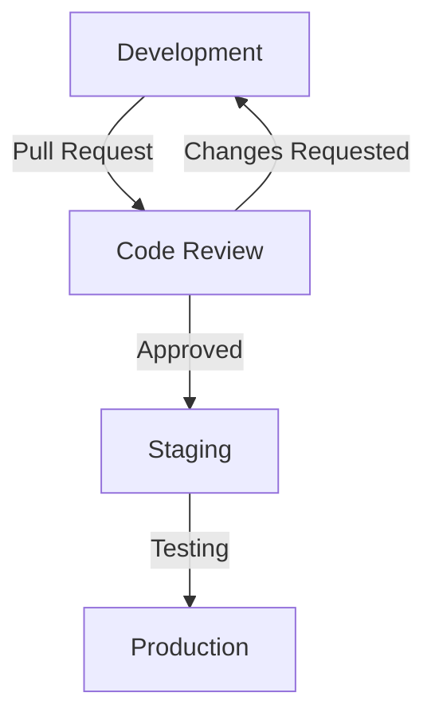

```
    ╔════════════╗    ╔════════════╗
    ║ ▓▓▓▓▓▓▓▓▓▓ ║    ║ El libro   ║
    ║ ▓▓▓▓▓▓▓▓▓▓ ║    ║ es el arma ║
    ║ ▓▓▓▓▓▓▓▓▓▓ ║    ║ más eficaz ║
    ║ ▓▓▓▓▓▓▓▓▓▓ ║    ║ para el    ║
    ║ ▓▓▓▓▓▓▓▓▓▓ ║    ║ progreso   ║
    ║ ▓▓▓▓▓▓▓▓▓▓ ║    ║            ║
    ║ ▓▓▓▓▓▓▓▓▓▓ ║    ║   José     ║
    ║ ▓▓▓▓▓▓▓▓▓▓ ║    ║  Carlos    ║
    ║ ▓▓▓▓▓▓▓▓▓▓ ║    ║ Mariátegui ║
    ╚════════════╝    ╚════════════╝
```

# Vicio Perpetuo Editorial Website

## About the Project

Vicio Perpetuo is an independent Peruvian publishing house celebrating literature in all its forms. We blend traditional publishing with cutting-edge digital solutions, creating a unique space for contemporary Peruvian literature.

## Key Features

Our platform offers a comprehensive suite of features designed to serve the literary community:

- Digital Bookstore: Complete catalog of contemporary Peruvian literature
- Multi-Currency Support: Traditional and cryptocurrency payments
- Editorial Blog: Literary discussions and author spotlights
- Event Platform: Book launches and cultural events
- Responsive Design: Optimized for all devices

## Technology Stack

### Frontend
```javascript
// Main application configuration
const appConfig = {
  framework: 'React',
  styling: 'Tailwind CSS',
  stateManagement: 'Redux',
  apiIntegration: 'Axios'
};
```

### Backend
```javascript
// Server setup with Express
import express from 'express';
import cors from 'cors';
import { bookRoutes, paymentRoutes, blogRoutes } from './routes';

const app = express();

app.use(cors());
app.use(express.json());

// API Routes
app.use('/api/books', bookRoutes);
app.use('/api/payments', paymentRoutes);
app.use('/api/blog', blogRoutes);

const PORT = process.env.PORT || 3000;
app.listen(PORT, () => console.log(`Server running on port ${PORT}`));
```

## Getting Started

### Prerequisites

```bash
node.js >= 14.0.0
npm >= 6.14.0
```

### Installation

```bash
# Clone repository
git clone https://github.com/your-username/vicioperpetuo-website.git

# Install dependencies
cd vicioperpetuo-website
npm install

# Configure environment
cp .env.example .env

# Start development server
npm run dev
```

## Feature Implementation Examples

### Cryptocurrency Payment Integration

```javascript
// Crypto payment service implementation
import Web3 from 'web3';
import { ethers } from 'ethers';

class CryptoPaymentService {
  constructor() {
    this.web3 = new Web3(Web3.givenProvider);
  }

  async processPayment(orderDetails) {
    try {
      const { amount, currency, walletAddress } = orderDetails;
      // Payment processing logic
      const transaction = await this.web3.eth.sendTransaction({
        to: walletAddress,
        value: this.web3.utils.toWei(amount.toString(), 'ether')
      });
      
      return {
        success: true,
        transactionHash: transaction.hash
      };
    } catch (error) {
      console.error('Payment processing error:', error);
      throw new Error('Payment failed');
    }
  }
}
```

### Mobile Payment Integration (Yape/Plin)

```javascript
// Mobile payment controller
class MobilePaymentController {
  async processYapePayment(req, res) {
    try {
      const { phoneNumber, amount, orderReference } = req.body;
      
      const paymentResult = await YapeAPI.createPayment({
        phone: phoneNumber,
        amount: amount,
        reference: orderReference
      });
      
      return res.status(200).json({
        success: true,
        paymentId: paymentResult.id
      });
    } catch (error) {
      return res.status(400).json({
        success: false,
        error: error.message
      });
    }
  }
}
```

### Book Catalog Management

```javascript
// Book model and controller
import mongoose from 'mongoose';

const BookSchema = new mongoose.Schema({
  title: { type: String, required: true },
  author: { type: String, required: true },
  genre: { type: String, required: true },
  price: { type: Number, required: true },
  isbn: { type: String, unique: true },
  cryptoPrice: { type: Number },
  stockStatus: { type: String, enum: ['available', 'preorder', 'outOfStock'] }
});

// Book controller methods
class BookController {
  async getAllBooks(req, res) {
    try {
      const books = await Book.find({});
      return res.status(200).json(books);
    } catch (error) {
      return res.status(500).json({ error: error.message });
    }
  }
}
```

## Development Workflow



## Project Structure

```
vicioperpetuo-website/
├── client/                 # Frontend React application
│   ├── src/
│   │   ├── components/    # Reusable UI components
│   │   ├── pages/        # Page components
│   │   ├── services/     # API services
│   │   └── styles/       # CSS/Tailwind styles
├── server/                # Backend Node.js/Express application
│   ├── controllers/      # Route controllers
│   ├── models/          # Database models
│   ├── routes/         # API routes
│   └── services/      # Business logic
└── shared/            # Shared utilities and types
```

## Contributing

We welcome contributions! Please check our contribution guidelines and follow these steps:

1. Fork the repository
2. Create your feature branch
3. Commit your changes
4. Push to the branch
5. Open a Pull Request

## Contact

- Website: [www.vicioperpetuo.com](http://www.vicioperpetuo.com)
- Email: info@vicioperpetuo.com
- Twitter: [@VicioPerpetuo](https://twitter.com/VicioPerpetuo)
- Facebook: [VicioPerpetuoEditorial](https://facebook.com/VicioPerpetuoEditorial)
- Instagram: [@edicionesvicioperpetuo](https://instagram.com/edicionesvicioperpetuo)

## Acknowledgments

We extend our gratitude to:
- Our talented authors
- The vibrant Peruvian literary community
- Open source contributors
- Our dedicated readers

---

<p align="center">
Crafted with ❤️ and {code} by Brutales XYZ
<br>
© 2024 Brutales XYZ - Where Digital Art Meets Literacy Revoluction✨
<br>
Founder: Mari Lin
</p>
